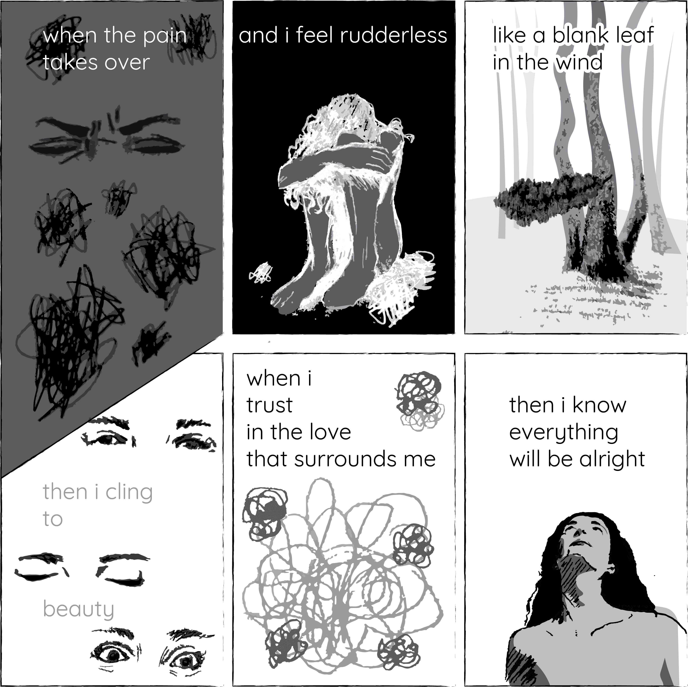
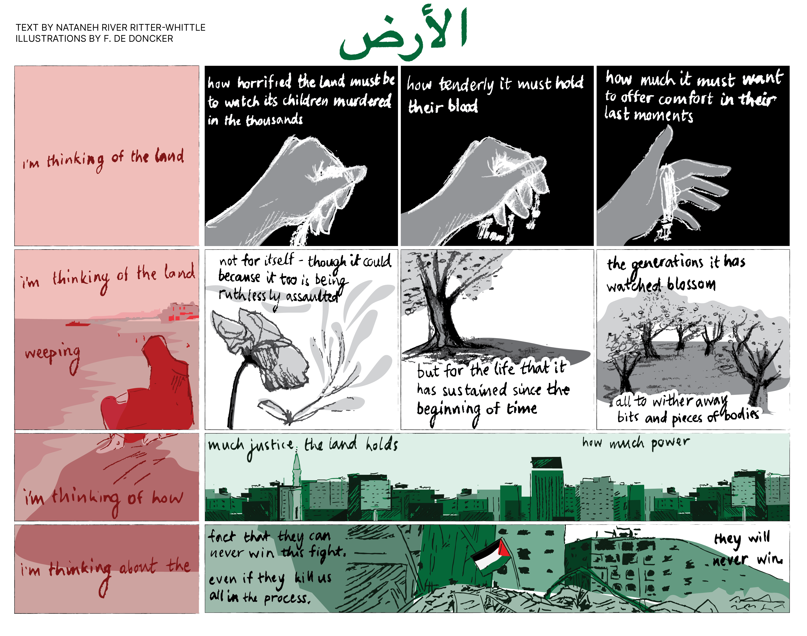
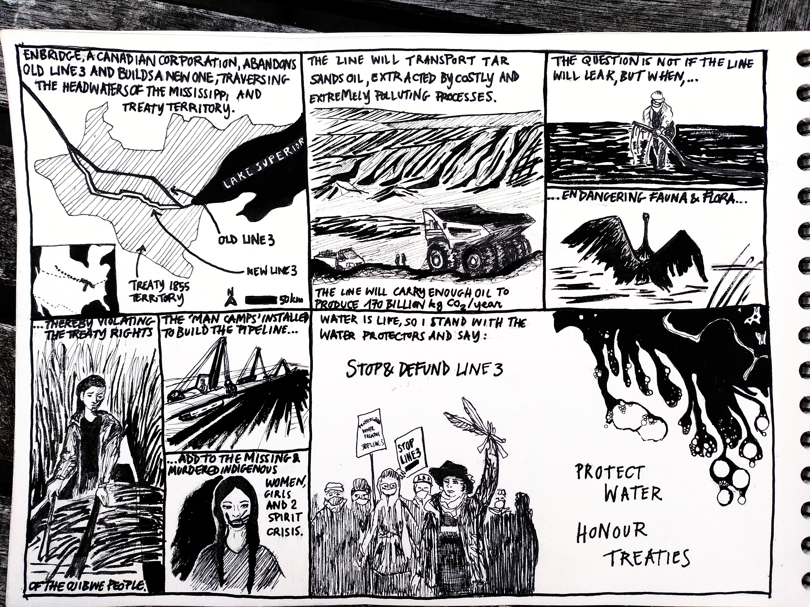

# Other comics
These are little comics I made to empty my head. (You can download the pngs of these in different languages.)

## Another one breathes the dust
Created for an op-ed for [REVOLVE](https://revolve.media), inspired by [work at 6-t bureau d'étude](https://www.6-t.co/etudes/precarite-et-mobilite-automobile-dans-le-canton-de-geneve-indicateurs-cles-et-enjeux). In Geneva, wealthier residents travel long distances in large cars, mostly for leisure, generating the greatest share of emissions. By contrast, poorer households often drive older, more polluting vehicles, but their trips are short and tied to necessity. Despite contributing less overall, they are the ones most exposed to the noise, fumes, and fine particles of traffic.

## Summer Palimpsest
Written in summer in Geneva, overflowing with feelings and trying to go with the flow while everyone else seems to have their life figured out.

## When the pain takes over
Beauty helps me to overcome pain, written in 2024.

## al-Ard
Text written by the very talented Nataneh River, illustrated for Zine Solidaire Avec La Palestine.

## Line 3 replacement
Trying to amplify the voices of the Water Protectors opposing the replacement of the Line 3 pipeline.
https://www.npr.org/2021/06/17/1007805657/indigenous-activist-on-why-groups-are-protesting-the-line-3-pipeline-in-minnesot
https://www.giniw.org/reports-media/media

